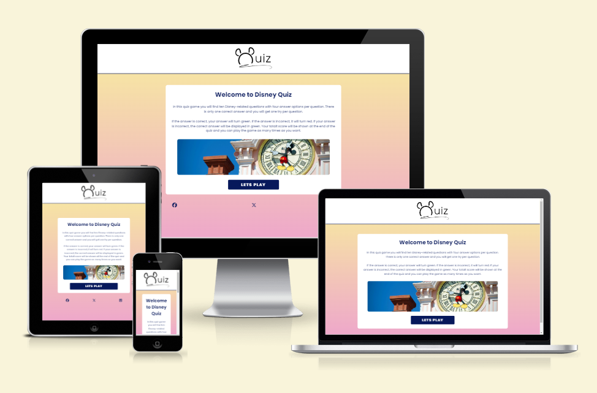
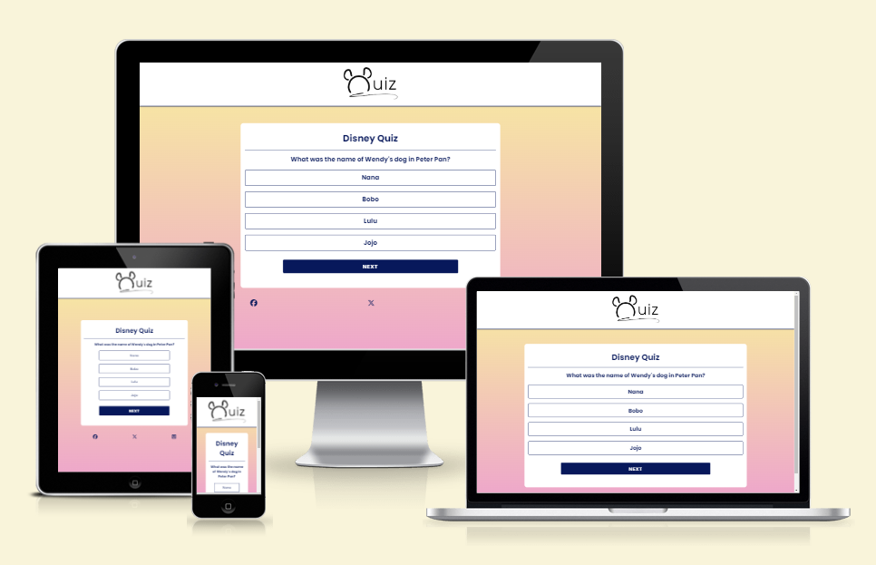
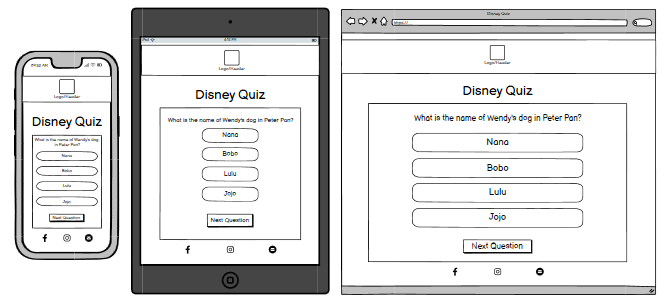
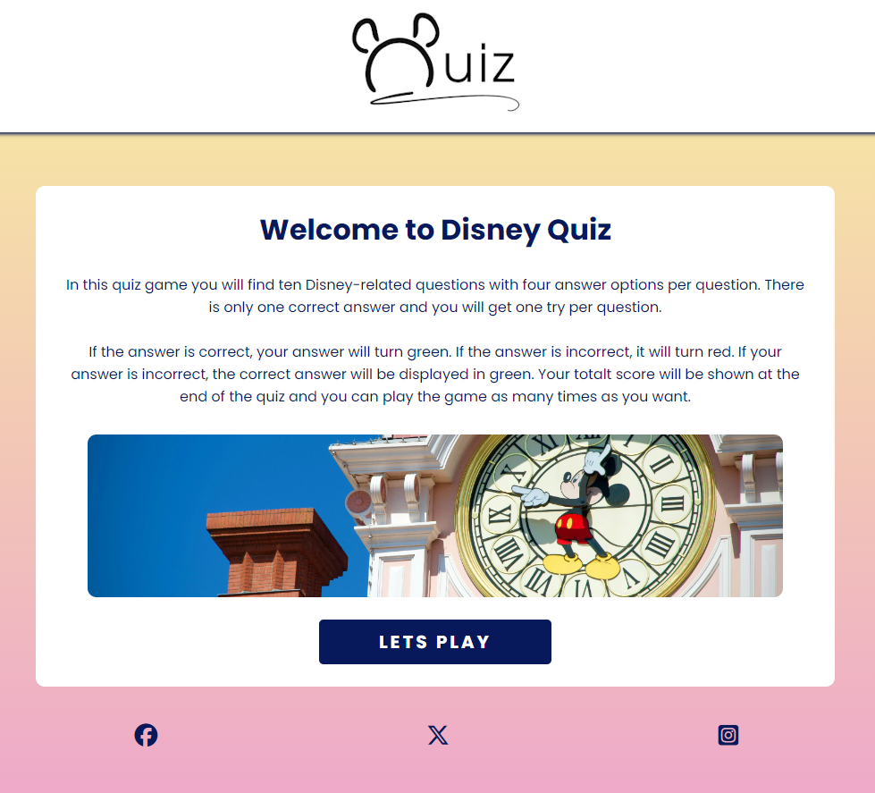
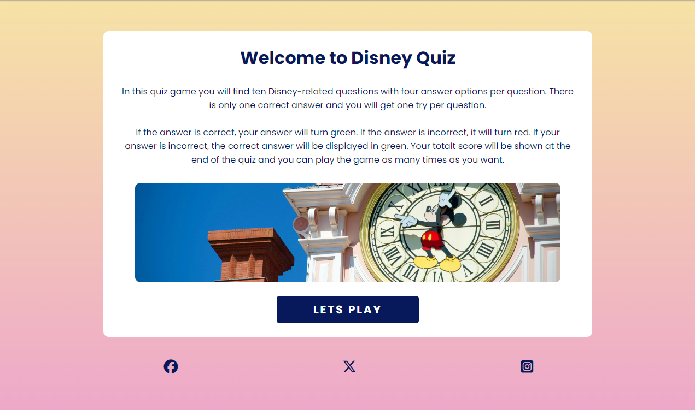
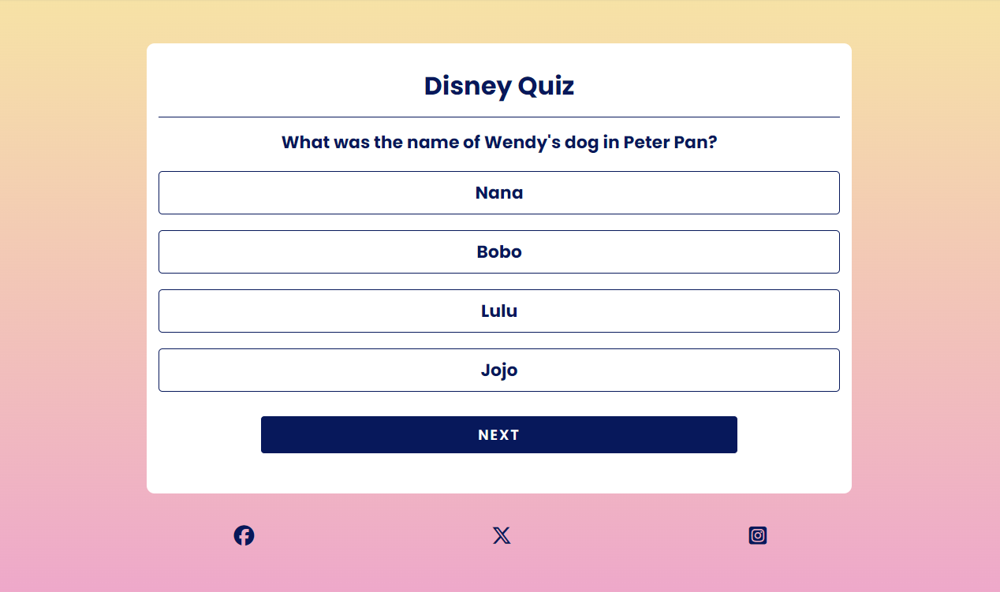
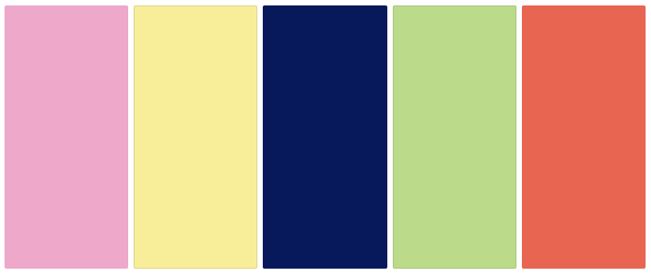

# Disney Quiz

This is a responsive site with a quiz. The quiz has 10 Disney-related questions with four answer options per question. You get one chance on each question, but you can redo the game as many times as you want. The quiz can be played by a wide age range of people and is an easily navigated game/site. 

Find the deployed site here: https://gigili89.github.io/disneyquiz/

## About the site
The site features a simple home page with a logo in the header which is clickable back to the home page. It also has a welcoming text as well as instructions about the quiz. Under the information text there is an image of a Mickey Mouse clock with matching colors to the gradient background (#eea8ca and #f8ee9a). After the image you'll find a "Lets Play" button that will take you to the quiz.At the bottom of the page you'l find the footer which includes three social media icons to: Facebook, X and Instagram. All icons are linked to their respective pages and opens in new tabs. 

On the game site there will still be the same background, header logo and footer icons. On this page you will find the acual quiz being presented, one question at a time and with four answer options per question. Under the options there's a "Next" button that will present the next question. You are not able to press the "Next" button if you haven't chosen an option first. 

When an option has been chosen you will find out straight away if the asnwer is correct. If the answer is correct the option button you have chosen will turn green. If it is incorrect it will turn red and the correct answer will be shown in green. 

At the end of the game you will find your score saying how many points you got out of how many questions. Under the score you'll have a button saying "Play Again" which will take you back to the beginning of the quiz. 

## Website Goals
### Business Goals
- A clear and easily navigates site for all ages
- Interactive with users
- The meaning (= quiz) should be easy to understand

### User Goals
- A fun game for all ages
- Simple to navigate and understand
- The quiz (function and mening vise) should be easy to play

## User Experience
### Potential users
- From young childrens to adults should be able to play the quiz
- Anyone interested in quizes or/and Disney

## User stories
### First time visitors
- Wants to play quiz
- Wants to find out what kind of questions it is
- Wants to see how many points they can score

### Returning visitors
- Wants to play the game again
- Wants to play with others that are first time visitors
- Wants to see if there's any new quizes

### Others
- Wants to find inspiration

## Site Administrator
As a site administrator, the page should: 
- Be easy to manage and navigate
- Be easy to update, for e.g. a new question to the quiz.
- Be easy to add new features or change the current features.

## Wireframe

## Features

The site features a clear and simple one page site including: 

### Header: 
A logo in the header that is linked back to the Home page. The logo was made by me, Gigi, in Canva. 

### Home page:
A welcome header with an instruction text about the quiz. A Mickey Mouse image that matches the background and a Lets Play button that will take you to the quiz.

### Quiz:
A quiz game, easily navigated with a question at the time together with 4 answer options per question. In total there are 10 Disney related questions. There's also a "next"-button to continue to the next question after picking an option. At the end of the quiz the scores will be shown as well as a button to play again. 

### Footer
Social media icons in the footer from Font Awesome, the icons are linked to the social media pages. One for Facebook, one for Instagram and one for X and they open in new tabs.

### Future Features
- Adding more quizes with a menu to navigate around the different quizes.
- Adding different quizes, for e.g. a quiz with images or a music quiz.

## Design
### Color Scheme
#ffffff
#07185B
#eea8ca
#07185b

In this color palette it is mainly the three first colors that are in the design. The green and the red are as well but they are only shown in the option buttons when the answer shown as correct or incorrect. 

### Font Family
For the logo, which I made in Canva, I used ITC Avant Garde Gothic.
For the rest of the site I used Poppins and the fall-back font is sans-serif (Google Fonts).
Bold (font-weight) was used on most text. 

## Images
- Logo, with a mickey mouse looking head at the start and "UIZ" at the end. 
I made in Canva and converted the image to webp afterwards. 
- The Mickey Mouse clock image at the home page. 
Found and borrowed from a user on Unsplash (link is further down under Credit)

## Languages
- HTML5 Markup Language, used to make the base of the site. 
- CSS, Used to style most parts of the site.
- JavaScript, Used to set all the functions/interactions for the game. 

- Github Repository
- Gitpod IDE to make the site

## Resources and credit
- Background Gradient: https://cssgradient.io/
- Convert, jpeg/png to webp: https://convertio.co/jpg-webp/
- Favicon: https://favicon.io/emoji-favicons/red-heart
- Font Awesome: https://fontawesome.com/
- Google Fonts: https://fonts.google.com/
- Canva, for making the logo: https://www.canva.com/
- Balsamiq Wireframe
- Lighthouse DevTool
- Checked contrast: https://dequeuniversity.com/rules/axe/4.8/color-contrast
- JavaScript and jQuery by Jon Duckett (Book)
- Am I Responsive: https://ui.dev/amiresponsive
- Color Palette: https://colors.muz.li/
- Mickey Mouse clock image: https://unsplash.com/es/fotos/torre-del-reloj-de-mickey-mouse-rkYKpJ11_kk
- Helped with questions: https://www.beano.com/posts/the-ultimate-disney-quiz + https://www.bbc.co.uk/newsround/52023721
- Markdown cheat sheet: https://www.markdownguide.org/cheat-sheet/
- Markdown table: https://thisdavej.com/copy-table-in-excel-and-paste-as-a-markdown-table/

### Testing resources
- Accessible Web: https://accessibleweb.com/website-accessibility-checker/
- WAVE: https://wave.webaim.org/
- W3C HTML Validator: https://validator.w3.org/
- W3C CSS Validator: https://jigsaw.w3.org/css-validator/
- JS Hint: https://jshint.com/

## Sources
- https://www.youtube.com/watch?v=Xrsb9SiF3a8

### Helped and inspired me
During this period of learning looked for sources that could help me understand and learn more about Javascript and programming a game.
- Code Institutes Love Math Walkthrough Project
- https://www.w3schools.com/howto/howto_js_toggle_hide_show.asp
- https://www.youtube.com/watch?v=riDzcEQbX6k
- https://simplestepscode.com/javascript-quiz-tutorial/
- https://www.altcademy.com/blog/how-to-make-a-quiz-in-javascript/
- https://www.geeksforgeeks.org/how-to-create-a-simple-javascript-quiz/
- https://www.codingninjas.com/studio/library/how-to-create-a-javascript-quiz-code

### Acknowledge
I also want to thank these people for everything they've done and taught me during this project:
- My mentor Sheryl, she has been amazing with tips and engcouraging me.
- My friend Dennis who is a developer and helped me understand Javascript.
- My friends and family who supports me a 100% during all of these.
- Code Institute and the Stack community who is always available and there to help and support.

Find my [TESTING.md](TESTING.md)