# Testing of Disney Quiz
Testing has been an ongoing procedure during the building of the site. I used Google Chrome and its DevTool to locate and troubleshoot any issues and to make sure the site would be responsive. The closer I got to finish the site, the more I tested the site. 

The site has been tested multiple times using DevTools and on different devices to make sure the site is responsive and works on all sizes, mainly these models: 
- Desktop
- Iphone 12 Pro
- Samsung Galaxy S8
- Ipad Mini
- Asuz Zenbook Fold
I tested both the home page and the quiz page on all devices. 

I've also deployed the site and sent the link to some friends and family to test and the results came back positive without errors.

## Tools
Apart from Google Chromes DevTools I also used the following tools:
- DevTools
- W3C HTML Validator
- W3c CSS Validator
- JS Hint
- Lighthouse

DevTools: No errors found.

W3C HTML Validator: No errors found.
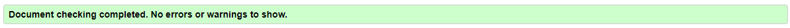

W3C CSS Validator: No errors found.
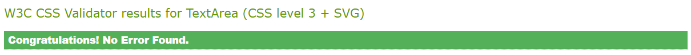

JS Hint: 14 ES6 warnings that can be ignored.
After consulting with my Mentor Sheryl I will ignore the ES6 errors.

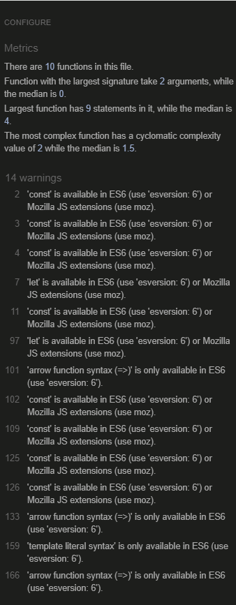

Lighthouse: 
Home page:
- Mobile version:

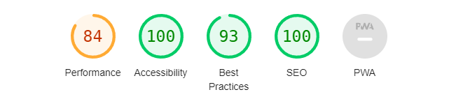

Warnings: Avoid large layout shifts and Largest Contentful Paint element.
I want the look to stay as it is and will therefor ignore the warning. 

- Desktop version: 

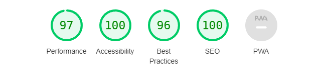

Warning: Preconnect to required origins
Was about the link to Google Fonts so I'm ignoring the warning. 

Quiz page: 
- Moble version:

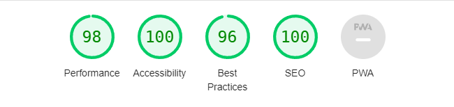
- Desktop version: 

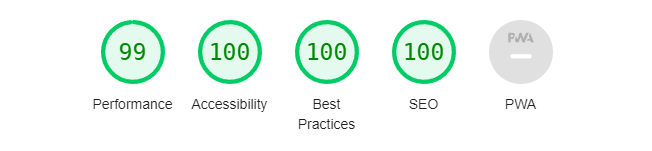

For both versions we had no warnings at all, just some yellow diagnostics.
The top diagnostic for both versions: 
- Enable text compression. I don't want to minimize it so I chose to ignore it. 

## Accessability
The accessability was tested on two different sites:

WAVE: no errors found.

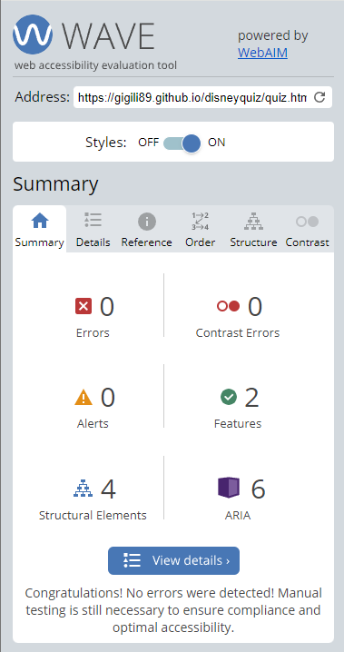

AccessableWeb: no errors found.

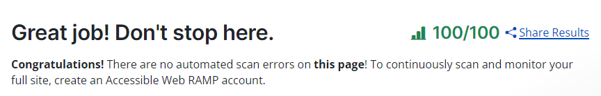

Checked contrast for white background together with the dark blue (#07185B) text and the other way around. They both passed: 

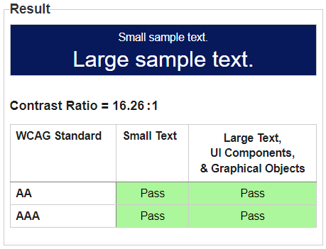
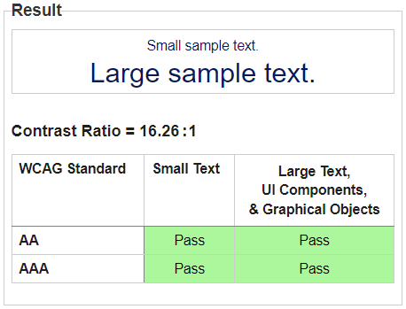

## Full Testing

**Home page:**

| FEATURES             | EXPECTED OUTCOME                                          | TESTING PERFORMED | RESULT                                                             | PASS/FAIL |
|----------------------|-----------------------------------------------------------|-------------------|--------------------------------------------------------------------|-----------|
| Logo image           | Image is linked to Home page                              | Clicked logo      | Redirected ("refreshed") back to Home page                         | Pass      |
| LETS PLAY button     | Button is linked to Quiz page                             | Clicked button    | Redirected to Quiz page                                            | Pass      |
| LETS PLAY button     | Text should change colour when hover from white to yellow | Hover             | Text changed color from white to yellow                            | Pass      |
| Facebook icon button | Redirect to FB page in new tab or to FB app               | Clicked button    | Redirected to FB page in new tab or app depending on device        | Pass      |
| X icon button        | Redirect to X page in new tab or to X app                 | Clicked button    | Redirected to X page in new tab or app depending on device         | Pass      |
| Instagram icon button | Redirect to Instagram page in new tab or app              | Clicked button    | Redirected to Instagram page in new tab or app depending on device | Pass      |

**Quiz page:** 

| FEATURES             | EXPECTED OUTCOME                                                                | TESTING PERFORMED                                    | RESULT                                                             | PASS/FAIL |
|----------------------|---------------------------------------------------------------------------------|------------------------------------------------------|--------------------------------------------------------------------|-----------|
| Logo image           | Image is linked to Home page                                                    | Clicked logo                                         | Redirected back to Home page                                       | Pass      |
| Next button          | Disabled until an answer is chosen                                              | Clicked button                                       | Nothing happend                                                    | Pass      |
| Answer options       | Should turn green or red when clicked depending if the answer is correct or not | Clicked both correct and incorrect buttons (answers) | Button turned green or red                                         | Pass      |
| Answer options       | If answer is incorrect the correct answer turns green                           | Clicked incorrect button                             | Incorrect button turned red and the correct button turned green    | Pass      |
| Answer options       | When hover the buttons should turn blue and the text white                      | Hover                                                | Button turned blue and the text white                              | Pass      |
| Next button          | When answer is chosen the Next button takes you to the next question            | Clicked button                                       | New question appears                                               | Pass      |
| Facebook icon button | Redirect to FB page in new tab or to FB app                                     | Clicked button                                       | Redirected to FB page in new tab or app depending on device        | Pass      |
| X icon button        | Redirect to X page in new tab or to X app                                       | Clicked button                                       | Redirected to X page in new tab or app depending on device         | Pass      |
| Instagram icon button | Redirect to Instagram page in new tab or app                                    | Clicked button                                       | Redirected to Instagram page in new tab or app depending on device | Pass      |

**Score page:**

| FEATURES             | EXPECTED OUTCOME                                                      | TESTING PERFORMED | RESULT                                                             | PASS/FAIL |
|----------------------|-----------------------------------------------------------------------|-------------------|--------------------------------------------------------------------|-----------|
| Logo image           | Image is linked to Home page                                          | Clicked logo      | Redirected back to Home page                                       | Pass      |
| Score                | Score should show with how many correct answers to how many questions | Played the quiz   | Showed the score                                                   | Pass      |
| Play Again button    | Redirects back to the start of the quiz                               | Clicked button    | Redirected back to the start of the quiz                           | Pass |
| Facebook icon button | Redirect to FB page in new tab or to FB app                           | Clicked button    | Redirected to FB page in new tab or app depending on device        | Pass      |
| X icon button        | Redirect to X page in new tab or to X app                             | Clicked button    | Redirected to X page in new tab or app depending on device         | Pass      |
| Instagram icon button | Redirect to Instagram page in new tab or app                          | Clicked button    | Redirected to Instagram page in new tab or app depending on device | Pass      |

## Additional information
There are 3 problems occuring in my with the Code Institute template. 
I've spoken to a tutor (Roman) who said I should just ignore it. I've also spoke to my mentor, Sheryl, she told me the same. 

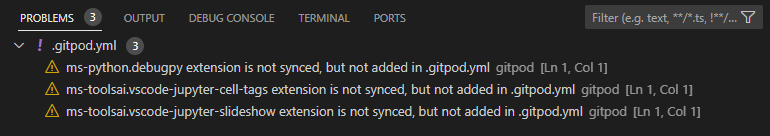

## New testing done
2024-04-16: After some changes to the code after feedback from the assessor I chose to test the site thoroughly again with the following results:

- W3C HTML Validator: Small error where the h1 tag was wrapped in a the article. The error was fixed by moving the h1 above and out of the article. Other than that, no errors found.
- W3c CSS Validator: No errors found.
- DevTools: No errors found. One console.log error was fixed with removing the script link from the index.html since no js coding were needed there. 
- JS hint: No new errors found, the same as above documented errors (only ES6) which will be ignored after consulting my mentor and tutor. 
- Lighthouse: No new changes, the same as above documentation. 
- WAVE: No errors found.
- Full testing: Full testing was done without any changes to the table above. (Most noticeable change for the user with the changes is the Let's Play button, where you are now able to click on the button background as well and not just the "Let's Play" text).