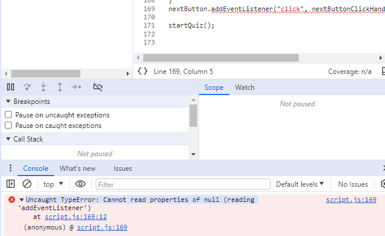

# Testing of Disney Quiz
Testing has been an ongoing procedure during the building of the site. I used Google Chrome and its DevTool to locate and troubleshoot any issues and to make sure the site would be responsive. The closwer I got to finish the site, the more I tested the site. 

The site has been tested multiple times using DevTools and on different devices to make sure the site is responsive and works on all sizes, mainly these models: 
- Desktop
- Iphone 12 Pro
- Samsung Galaxy S8
- Ipad Mini
- Asuz Zenbook Fold
I tested both the home page and the quiz page on all devices. 

I've also deployed the site and sent the link to some friends and family to test and the results came back positive without errors.

## Tools
Apart from Google Chromes DevTools I also used the following tools:
- DevTools
- W3C HTML Validator
- W3c CSS Validator
- JS Hint
- Lighthouse

- DevTools: one console error on the Home Page that states that: "Uncaught TypeError: Cannot read properties of null".
Which is Line 169 in the JavaScript code. The error disappears as soon as you click to the quiz page which is where the function is so I've chosen to ignore it. 
 

W3C HTML Validator: No errors found.

W3C CSS Validator: No errors found.

JS Hint: 14 ES6 warnings that can be ignored.
After consulting with my Mentor Sheryl I will ignore the ES6 errors.

Lighthouse: 
Home page:
- Mobile version:

Warnings: Avoid large layout shifts and Largest Contentful Paint element.
I want the look to stay as it is and will therefor ignore the warning. 

- Desktop version: 

Warning: Preconnect to required origins
Was about the link to Google Fonts so I'm ignoring the warning. 

Quiz page: 
- Moble version:

- Desktop version: 

For both versions we had no warnings at all, just some yellow diagnostics.
The top diagnostic for both versions: 
- Enable text compression. I don't want to minimize it so I chose to ignore it. 

## Accessability
The accessability was tested on two different sites:

WAVE: no errors found.

AccessableWeb: no errors found.

Checked contrast for white background together with the dark blue (#07185B) text and the other way around. They both passed: 

